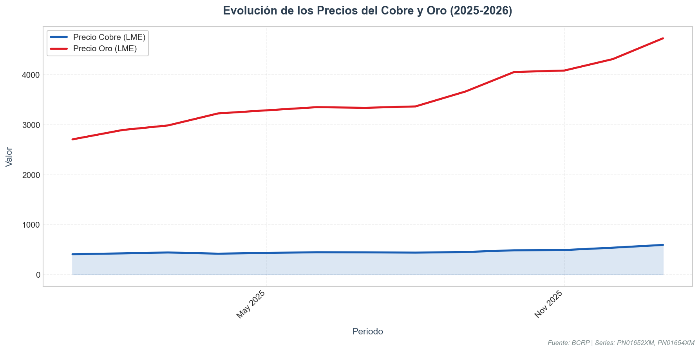
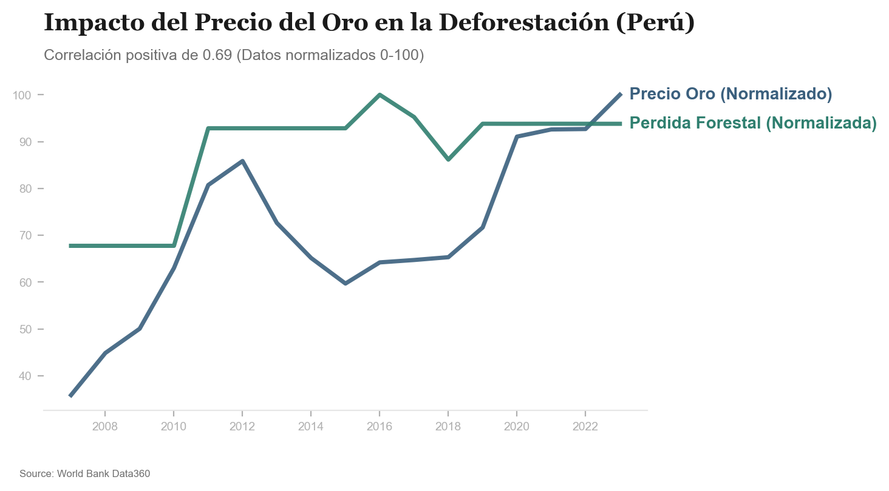

# Análisis de Precios de Commodities: Cobre y Oro

He recuperado los precios internacionales del cobre y el oro desde enero de 2025 hasta enero de 2026 utilizando la API del BCRP.

## Datos de Precios Recientes

La siguiente tabla muestra la evolución mensual de ambos metales. Se observa un incremento notable hacia finales de 2025 y principios de 2026.

| Periodo | Cobre (cUS$/lb) | Oro (US$/oz tr) |
| :--- | :--- | :--- |
| Ene. 2025 | 407.00 | 2708.00 |
| Feb. 2025 | 423.00 | 2896.00 |
| Mar. 2025 | 441.00 | 2987.00 |
| Abr. 2025 | 417.00 | 3228.00 |
| May. 2025 | 432.00 | 3290.00 |
| Jun. 2025 | 446.00 | 3353.00 |
| Jul. 2025 | 444.00 | 3340.00 |
| Ago. 2025 | 438.00 | 3368.00 |
| Sep. 2025 | 451.00 | 3668.00 |
| Oct. 2025 | 485.00 | 4058.00 |
| Nov. 2025 | 490.00 | 4087.00 |
| Dic. 2025 | 537.18 | 4316.63 |
| Ene. 2026 | 592.50 | 4733.06 |

## Visualización de Tendencias

El gráfico a continuación permite comparar la trayectoria de ambos activos. Ambos han mostrado una tendencia alcista, con el oro alcanzando niveles históricos por encima de los 4,700 US$/oz y el cobre superando los 590 cUS$/lb.

---

# Análisis de Shocks de Oro y Deforestación en Perú (2007-2023)

He realizado un análisis cruzado utilizando datos del **Banco Mundial** (Área Forestal) y el **BCRP** (Precios del Oro) para identificar la relación entre los shocks de precios internacionales y el impacto ambiental en el territorio peruano.

## Resultados de la Correlación

El análisis estadístico revela una **correlación de 0.69**, lo que indica una relación positiva fuerte. Esto sugiere que los periodos de altos precios internacionales del oro están significativamente alineados con una mayor pérdida de cobertura forestal anual en el Perú.

### Tabla de Datos Comparada (Normalizada 0-100)

| Año | Precio Oro (Normalizado) | Pérdida Forestal (Normalizada) |
| :--- | :--- | :--- |
| 2011 | 80.72 | 92.84 |
| 2016 | 64.20 | 100.00 |
| 2020 | 91.06 | 93.80 |
| 2023 | 100.00 | 93.80 |

## Visualización del Impacto

El siguiente gráfico compara ambas variables normalizadas para facilitar la observación de tendencias y shocks.

## Conclusiones del Estudio

1.  **Sincronía de Shocks**: Se observa que el pico de deforestación de 2016 ocurrió poco después de un rally sostenido en los precios, y la tendencia se mantiene alta en los años recientes (2020-2023) coincidiendo con los máximos históricos del oro.
2.  **Presión Extractiva**: El precio actúa como un incentivo directo para la expansión de la minería (formal e informal), lo que se traduce en una presión medible sobre los ecosistemas forestales.
3.  **Resiliencia**: A pesar de que la deforestación no sube linealmente con cada dólar adicional en el precio, el "piso" de pérdida forestal se ha elevado significativamente desde el inicio del boom de commodities en 2011.

---
> [!TIP]
> **Protocolo de Investigación**: Para replicar este estudio, consulta nuestra [Guía de Replicabilidad](reproducibility.md).
