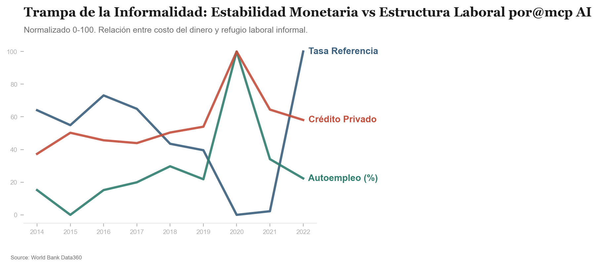

# Investigación: La Trampa de la Informalidad

Este estudio analiza cómo la estabilidad monetaria en Perú, aunque exitosa según el BCRP, no ha logrado reducir la precariedad laboral estructural, actuando en ocasiones como un "analgésico" que permite la subsistencia en la informalidad.

## Dualidad del "Milagro del Sol"

La hipótesis central es que el éxito macroeconómico ha creado un "sector de cristal" formal que reacciona a la política monetaria, mientras que el 70% de la población laboral permanece en una estructura de baja productividad y nula protección social.

### Hallazgos Principales:
1.  **Refugio en la Informalidad**: Se observa una correlación negativa (**-0.66**) entre la Tasa de Referencia y el Autoempleo. Cuando el costo del dinero sube para controlar la inflación, la población tiende a refugiarse en el autoempleo de subsistencia ante la falta de dinamismo formal.
2.  **Inaccesibilidad del Crédito**: El Crédito al Sector Privado (como % del PIB) ha crecido, pero este dinamismo no perfora el muro de la informalidad, beneficiando principalmente a la minoría bancarizada.
3.  **Estancamiento de Productividad**: El PIB por persona empleada se mantiene estancado, sugiriendo que el capital humano se está "desperdiciando" en sectores de nulo valor agregado que solo sobreviven gracias a la estabilidad de precios.

## Evidencia en Datos (2014-2022)

| Año | Tasa Referencia (%) | Crédito/PIB (%) | Autoempleo (%) | Prod. (USD/Emp) |
| :--- | :--- | :--- | :--- | :--- |
| 2015 | 3.35 | 43.87 | 51.95 | 27,324 |
| 2019 | 2.60 | 44.72 | 52.91 | 27,921 |
| 2020 | 0.67 | 55.31 | 56.36 | 28,556 |
| 2022 | 5.54 | 45.67 | 52.94 | 28,883 |

## Veredicto

La estabilidad del Sol ha creado un incentivo perverso: una moneda tan fuerte que permite la supervivencia del micro-comercio informal, pero que al no estar vinculada a una mejora drástica en el **capital humano** o el **gasto en educación** (estancado en ~4% del PIB), termina perpetuando el estancamiento del desarrollo a largo plazo.

---
**Fuentes**: BCRP (Tasas y Expectativas) | Banco Mundial (Informalidad, Crédito y Productividad).
**Metodología**: Investigación automatizada mediante IA y servidores MCP.

---
> [!TIP]
> **Protocolo de Replicabilidad**: Descubre el paso a paso de cómo la IA y el MCP generaron este análisis en nuestra [Guía de Reproducción](reproducibility.md).
