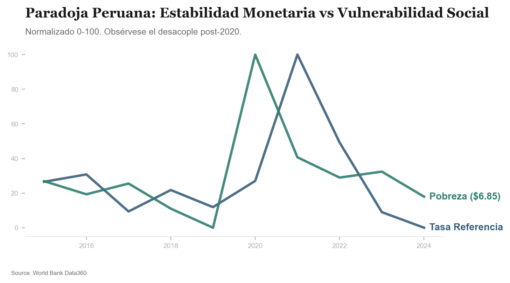

# Investigación: La Paradoja de la Economía Peruana

Este informe documenta la desconexión estructural entre la estabilidad monetaria gestionada por el BCRP y los indicadores de bienestar social del Banco Mundial.

## El Diagnóstico: "Armadura Tecnológica, Cuerpo Precario"

La economía peruana presenta una dualidad crítica:
- **Resiliencia Monetaria**: El control de la inflación y un Tipo de Cambio Real Multilateral estable han protegido el valor del Sol.
- **Vulnerabilidad Social**: La tasa de pobreza ($6.85 diarios) muestra que la clase media vulnerable no ha recuperado sus niveles prepandemia, retrocediendo hacia la precariedad.

## Evidencia Empírica (2015-2024)

### 1. Desacople Estabilidad vs. Pobreza
Los datos revelan que la **Tasa de Interés de Referencia** ha mantenido un control estricto sobre los precios, pero con una correlación débil (**0.23**) respecto a la reducción de la pobreza. Esto sugiere que el "amortiguador de crisis" monetario no se traduce automáticamente en un "motor de ascenso social".

### 2. Estancamiento de la Productividad
A pesar de un "Sol fuerte" que facilita el consumo, la **Productividad Total de los Factores** se ha mantenido estancada. La estabilidad cambiaria parece haber enmascarado la falta de transformación productiva, beneficiando al sector financiero y comercio urbano mientras los sectores transables pierden competitividad relativa por falta de infraestructura y capital humano.

| Año | Tasa Interbancaria (Indice) | Pobreza $6.85 (%) | Gini Index | Productividad (GDP/Emp) |
| :--- | :--- | :--- | :--- | :--- |
| 2019 | 96.41 | 33.6 | 41.5 | 27,921 |
| 2020 | 99.15 | 48.1 | 43.7 | 28,555 |
| 2023 | 95.89 | 38.3 | 40.7 | 29,314 |

## Veredicto Final

Perú ha logrado una maestría en la gestión del ciclo corto (macroeconomía), pero está perdiendo la batalla del desarrollo estructural. La estabilidad monetaria es una **condición necesaria**, pero la falta de motores reales de productividad y la persistencia de una alta vulnerabilidad social sugieren que el modelo actual está priorizando la defensa de la moneda sobre la expansión de la capacidad productiva nacional.

---
**Fuentes**: BCRP (Series PN01271PM, PN00120MM, PN01259PM) | Banco Mundial (SI.POV.UMIC, SI.POV.GINI, SL.GDP.PCAP.EM.KD).
**Metodología**: Procesamiento mediante IA + Protocolo MCP para acceso a datos en tiempo real (enero 2026).

> [!TIP]
> **Protocolo de Replicabilidad**: Descubre el paso a paso de cómo la IA y el MCP generaron este análisis en nuestra [Guía de Reproducción](reproducibility.md).
